# Mocha Automata (My Personal Multi-Agent Discord & Obsidian Suite)

<p align="center">

</p>

[](https://github.com/frtzhahn/mocha-automata/actions/workflows/ci.yml)[](https://nodejs.org/)[](https://discord.js.org)[](https://openrouter.ai)[](https://obsidian.md)[](https://www.gnu.org/licenses/gpl-3.0)

**Mocha Automata** is my personal multi-agent Discord bot suite integrated with an Obsidian vault companion engine, built with modern Node.js (ECMAScript Modules) and discord.js v14.

This is built specifically for my own local first autonomy, minimal resource consumption, and zero-cost inference via dynamic OpenRouter model cascades, lookahead speech sanitization, and atomic POSIX file system vault operations.

---

## Architecture Overview

The system operates as a lightweight local harness (mini agent harness) that maintains deterministic control over all LLM interactions, token ceilings, and file modifications:

```mermaid
graph TD
    %% Define Styles
    classDef client fill:#5865F2,stroke:#333,stroke-width:2px,color:#fff;
    classDef harness fill:#2C2F33,stroke:#7289DA,stroke-width:2px,color:#fff;
    classDef module fill:#23272A,stroke:#99AAB5,stroke-width:1px,color:#fff;
    classDef safety fill:#faa61a,stroke:#333,stroke-width:1px,color:#fff;
    classDef external fill:#43b581,stroke:#333,stroke-width:2px,color:#fff;
    classDef vault fill:#794fc4,stroke:#333,stroke-width:2px,color:#fff;

    %% Elements
    Clients["**Discord Clients**<br>(Mobile, Desktop, Web Interactions)"]:::client

    subgraph Harness ["Local Node.js Autonomous Harness (Mocha Automata)"]
        direction TB
        
        %% Core modules
        D["**disceptatio**<br>Dialectical Arena"]:::module
        E["**eeper**<br>Low-Energy Companion"]:::module
        M["**mocha-copiloto**<br>Vault & Study Partner"]:::module

        %% Safety Engines
        SS["**Speech Sanitizer & Guardrails**<br>• Strips &lt;think&gt; / plain CoT<br>• Moderation filter leaks"]:::safety
        VS["**Vault Safety Engine**<br>• Atomic .tmp → rename<br>• Regex heading insertion"]:::safety
    end
    style Harness fill:#23272A,stroke:#7289DA,stroke-width:2px,stroke-dasharray: 5 5

    OR["**OpenRouter Model Cascade Pool**<br>(Dynamic Free Zero-Cost Discovery)<br>• Nemotron, Ling, Nex-AGI, LFM, etc."]:::external
    OV["**Obsidian Vault**<br>(Daily Schedules, Memos, Notes)<br>Markdown Frontmatter AST Engine"]:::vault

    %% Connections
    Clients -->|WebSocket Gateway & REST API| Harness
    
    D & E & M --> SS
    D & E & M --> VS

    SS -->|HTTPS POST| OR
    VS -->|POSIX FS Syscalls| OV
```




---

## Package Ecosystem

The monorepo contains three specialized autonomous agents inside `packages/`:

### 1. `packages/disceptatio`
An automated 3 round dialectical debate arena bot for Discord.
- **Thesis vs. Antithesis:** Coordinates structured intellectual debates between opposing AI viewpoints or community participants.
- **Debate Synthesis:** Condenses argumentative points into a neutral conclusion.
- **Failover Cascade:** Dynamic discovery of active zero-cost text models with automatic retry logic.

### 2. `packages/eeper`
A low-energy, cat companion and conversational peer.
- **Sliding Buffer Context:** Maintains rolling conversation memory capped at 10 items to prevent context sprawl and quota exhaustion.
- **Speech Sanitizer:** Strips XML chain-of-thought blocks (`<think>`, `<thought>`), plain-text drafting traces, and provider safety leaks.
- **Multimodal Vision:** Analyzes incoming image attachments and synthesizes visual descriptions directly into context.

### 3. `packages/mocha-copiloto`
My curated Obsidian study buddy and personal knowledge management companion.
- **Obsidian Vault Integration:** Read-only indexing of notes (`mocha-vault/` or external vault) and atomic section writing (`/write`).
- **Dynamic Persona Switcher (`/persona switch`):** Hot-swappable communication calibrations (`mocha`, `academic`, `friendly`) sourced dynamically from markdown frontmatter templates.
- **The Memo Engine (`/memo`):** Structured research scratchpad management (`create`, `append`, `read`) with frontmatter AST synchronization.
- **Interactive Quiz Engine (`/quiz`):** Two-stage concept and coding evaluation with TTL expiration.
- **Automated Midnight Debriefs:** Background 60-second scheduler that analyzes completed vs. pending tasks at 12:00 AM and publishes reports to Discord and the vault.
- **Lively Interactions:** In character Discord emoji reactions and context-aware Giphy meme responses.

---

## Quickstart Guide

### Prerequisites
- Node.js LTS (version 18.0.0 or higher)
- npm or pnpm
- Git

### 1. Clone the Monorepo
```bash
git clone https://github.com/frtzhahn/mocha-automata.git
cd mocha-automata
```

### 2. Install Workspace Dependencies
Install dependencies across all packages in a single command from the monorepo root:
```bash
npm install
```

### 3. Configure Your Agent
Navigate to your chosen agent package and copy the environment template:
```bash
# Example: Configuring mocha-copiloto
cd packages/mocha-copiloto
cp .env.example .env
```

Populate the `.env` file with your credentials:
```ini
DISCORD_BOT_TOKEN="your-bot-token"
DISCORD_CLIENT_ID="your-client-id"
OPENROUTER_API_KEY="your-openrouter-key"
LLM_MODEL="openrouter/free"
VISION_MODEL="openrouter/free"
VAULT_DIR="./mocha-vault"
LOG_CHANNELS="123456789012345678"
```

### 4. Run the Agent
Start the agent from within its directory:
```bash
npm start
```
Or launch any agent directly from the monorepo root:
```bash
npm run start:mocha
# or: npm run start:disceptatio
# or: npm run start:eeper
```

---

## Cross-Platform Deployment Documentation

Setup and background service guides are provided for each supported host environment:

- [Linux Deployment Guide (Arch, CachyOS, Ubuntu)](docs/setup-linux.md): Native Node.js, `systemd` user units, and `tmux`.
- [Android Termux Guide](docs/setup-termux.md): Mobile hosting, `termux-wake-lock`, storage permissions, and memory management.
- [Windows Deployment Guide](docs/setup-windows.md): PowerShell, winget, Modern Standby power configuration, and PM2/NSSM services.

---

## Contributing

Please review [.github/PULL_REQUEST_TEMPLATE.md](.github/PULL_REQUEST_TEMPLATE.md) when submitting pull requests. All contributions must pass continuous integration syntax checks across Node.js 18.x, 20.x, and 22.x:

```bash
node --check packages/disceptatio/bot.js
node --check packages/eeper/bot.js
node --check packages/mocha-copiloto/bot.js
```


---

## License

This project is licensed under the terms of the [GNU General Public License v3.0](LICENSE).


